# MAF Orchestration Visual Guide

This document provides visual diagrams to help understand the Microsoft Agent Framework (MAF) orchestration architecture.

## Table of Contents
1. [Current vs Proposed Architecture](#current-vs-proposed-architecture)
2. [MAF Component Architecture](#maf-component-architecture)
3. [Agent Workflow Patterns](#agent-workflow-patterns)
4. [Migration Strategy](#migration-strategy)
5. [Directory Structure](#directory-structure)

## Current vs Proposed Architecture

### Current Architecture (LlamaIndex.TS)

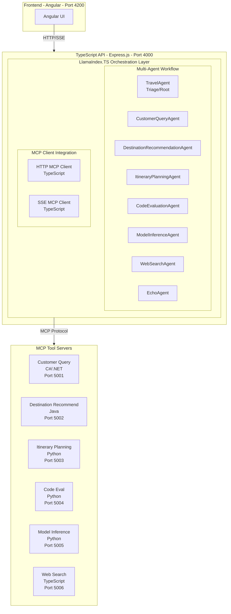

### Proposed Architecture (MAF)

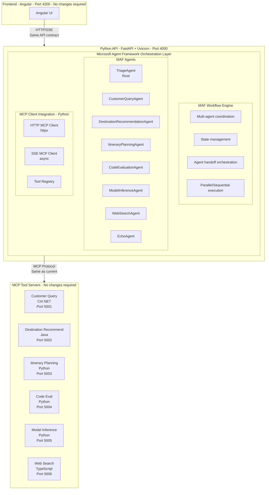

**Key Changes**:
- ✅ Replace Express.js → FastAPI
- ✅ Replace LlamaIndex.TS → Microsoft Agent Framework
- ✅ Replace TypeScript → Python
- ✅ Keep same API contract (no UI changes)
- ✅ Keep same MCP tool servers (no changes)

## MAF Component Architecture

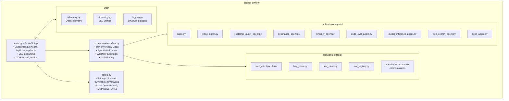

## Agent Workflow Patterns

### Sequential Workflow

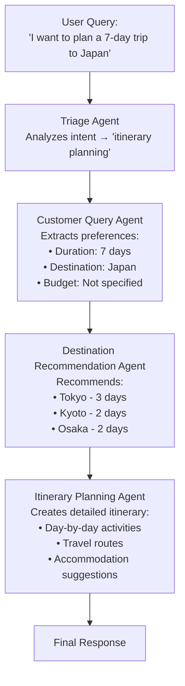

### Parallel Workflow

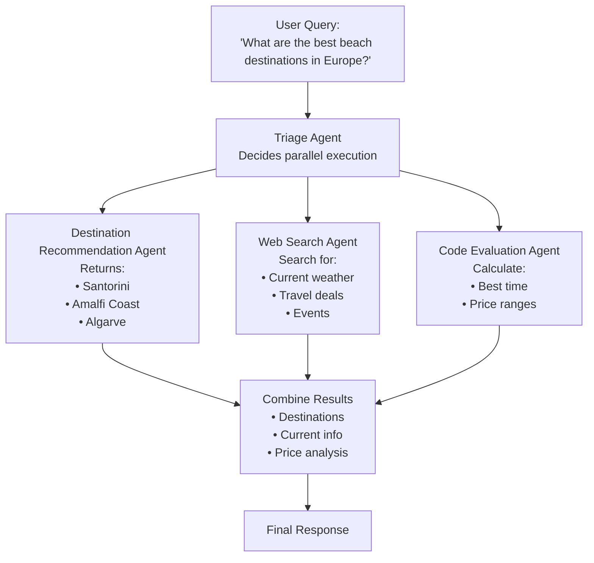

### Conditional Workflow with Agent Handoff

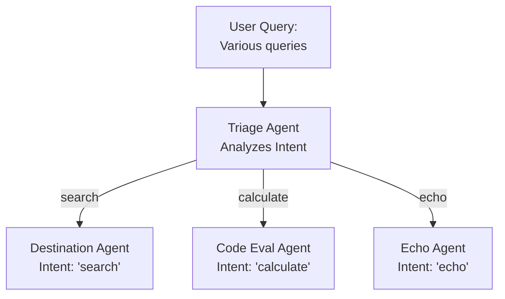

## Migration Strategy

### Parallel Deployment Approach

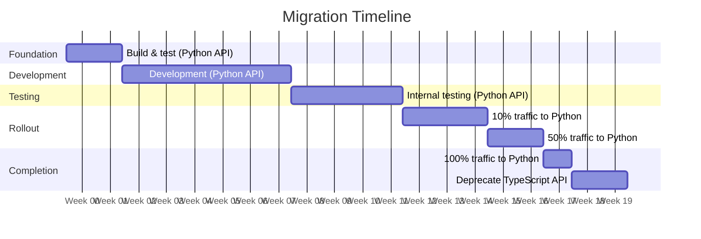

**Traffic Distribution by Phase:**

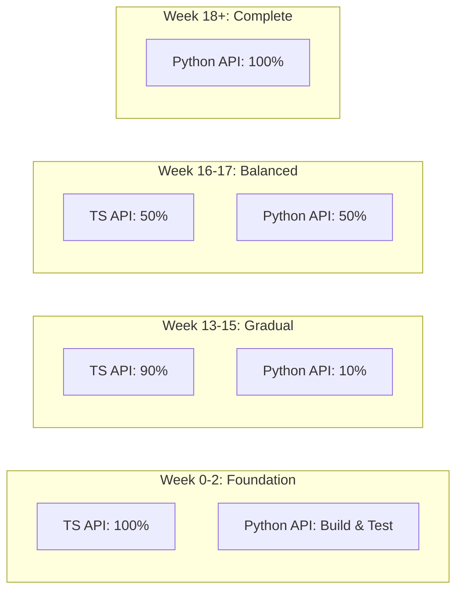

## Directory Structure

### Current Structure
```
src/
├── api/                          # TypeScript API
│   ├── src/
│   │   ├── index.ts             # Express server
│   │   ├── mcp/                 # MCP clients
│   │   │   ├── mcp-http-client.ts
│   │   │   ├── mcp-sse-client.ts
│   │   │   └── mcp-tools.ts
│   │   └── orchestrator/
│   │       └── llamaindex/      # LlamaIndex.TS
│   │           ├── index.ts     # Agent setup
│   │           ├── providers/   # LLM providers
│   │           └── tools/       # Tool config
│   ├── package.json
│   └── tsconfig.json
├── tools/                        # MCP servers
│   ├── customer-query/          # C#/.NET
│   ├── destination-recommendation/ # Java
│   ├── itinerary-planning/      # Python
│   ├── code-evaluation/         # Python
│   ├── model-inference/         # Python
│   ├── web-search/              # TypeScript
│   └── echo-ping/               # TypeScript
└── ui/                          # Angular frontend
```

### Proposed Structure (Parallel)
```
src/
├── api/                          # TypeScript API (existing)
│   └── ...
├── api-python/                   # NEW: Python API
│   ├── src/
│   │   ├── main.py              # FastAPI server
│   │   ├── config.py            # Configuration
│   │   ├── orchestrator/        # MAF orchestration
│   │   │   ├── __init__.py
│   │   │   ├── workflow.py      # Workflow engine
│   │   │   ├── agents/          # Agent implementations
│   │   │   │   ├── __init__.py
│   │   │   │   ├── base.py
│   │   │   │   ├── triage_agent.py
│   │   │   │   ├── customer_query_agent.py
│   │   │   │   ├── destination_agent.py
│   │   │   │   ├── itinerary_agent.py
│   │   │   │   ├── code_eval_agent.py
│   │   │   │   ├── model_inference_agent.py
│   │   │   │   ├── web_search_agent.py
│   │   │   │   └── echo_agent.py
│   │   │   └── tools/           # MCP client integration
│   │   │       ├── __init__.py
│   │   │       ├── mcp_client.py
│   │   │       ├── http_client.py
│   │   │       ├── sse_client.py
│   │   │       └── tool_registry.py
│   │   ├── api/                 # API routes
│   │   │   ├── __init__.py
│   │   │   ├── chat.py
│   │   │   ├── tools.py
│   │   │   └── health.py
│   │   └── utils/               # Utilities
│   │       ├── __init__.py
│   │       ├── telemetry.py
│   │       ├── streaming.py
│   │       └── logging.py
│   ├── tests/                   # Test files
│   │   ├── __init__.py
│   │   ├── test_agents.py
│   │   ├── test_workflow.py
│   │   └── test_api.py
│   ├── pyproject.toml           # Python dependencies
│   ├── Dockerfile               # Container config
│   └── .env.sample              # Environment template
├── tools/                        # MCP servers (no changes)
│   └── ...
└── ui/                          # Angular frontend (no changes)
```

## Technology Stack Comparison

```mermaid
graph LR
    subgraph CURRENT["Current - LlamaIndex.TS"]
        direction TB
        CL[Language: TypeScript]
        CR[Runtime: Node.js 22+]
        CW[Web Framework: Express.js 5.0]
        CA[Agent Framework: LlamaIndex.TS 0.10.3]
        CM[MCP Client: @llamaindex/tools 0.1.2]
        CT[Type System: TypeScript]
        CP[Package Manager: npm]
        CC[Config: .env + dotenv]
        CO[Observability: OpenTelemetry]
    end
    
    CURRENT -->|MIGRATION| PROPOSED
    
    subgraph PROPOSED["Proposed - Microsoft Agent Framework"]
        direction TB
        PL[Language: Python 3.12+]
        PR[Runtime: Python]
        PW[Web Framework: FastAPI + Uvicorn]
        PA[Agent Framework: agent-framework - MAF]
        PM[MCP Client: Custom - httpx-based]
        PT[Type System: Pydantic]
        PP[Package Manager: pip]
        PC[Config: .env + pydantic-settings]
        PO[Observability: OpenTelemetry]
    end
```

## Request Flow Comparison

### Current Flow (LlamaIndex.TS)
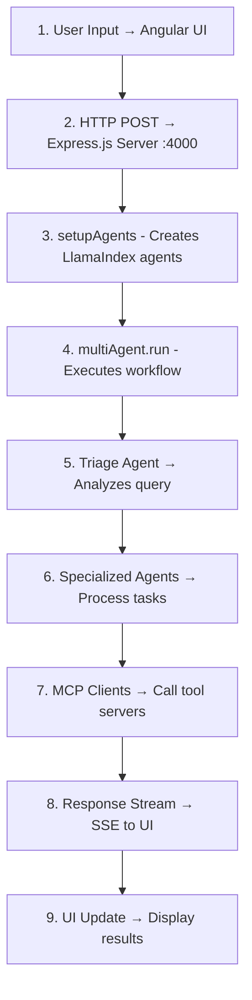

### Proposed Flow (MAF)
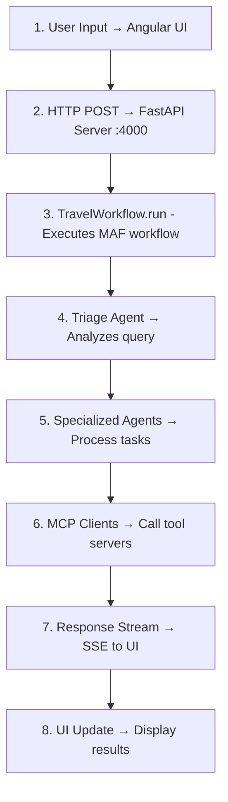

**Note**: The flow is essentially identical from the UI perspective!

## Benefits Summary

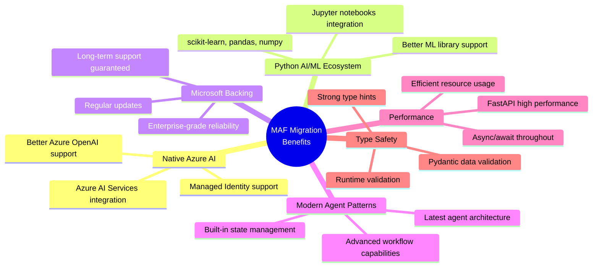

## Next Steps

1. **Review Documentation**
   - Read [MAF-README.md](./MAF-README.md) for complete overview
   - Study [maf-orchestration-design.md](./maf-orchestration-design.md) for architecture
   - Review [maf-migration-plan.md](./maf-migration-plan.md) for timeline

2. **Make Decision**
   - Stay with LlamaIndex.TS
   - Migrate to MAF
   - Parallel deployment (recommended)

3. **Begin Implementation**
   - Follow [maf-implementation-guide.md](./maf-implementation-guide.md)
   - Use [maf-quick-reference.md](./maf-quick-reference.md) for coding

---

**Document Version**: 1.0  
**Last Updated**: 2025-01-02  
**Status**: Planning Complete
