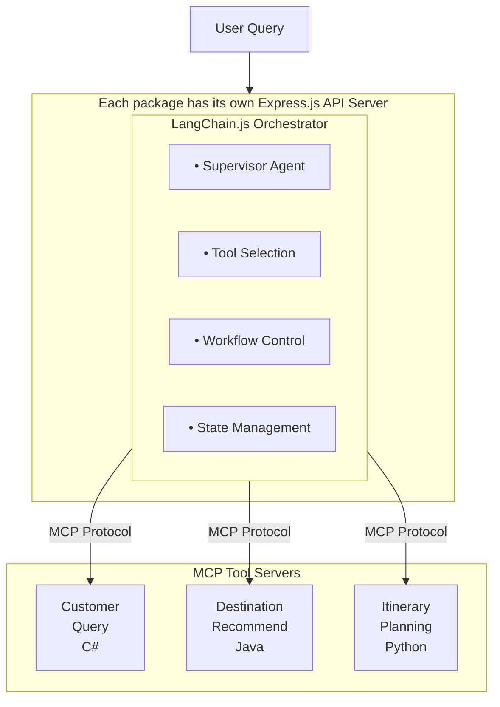
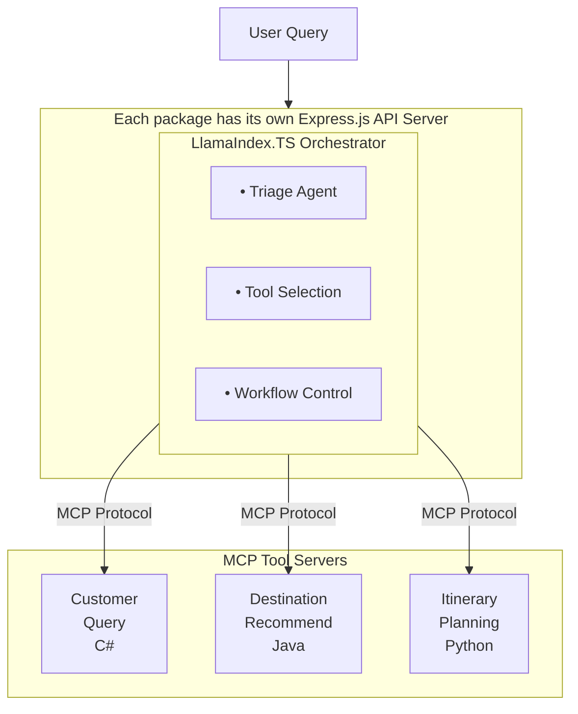
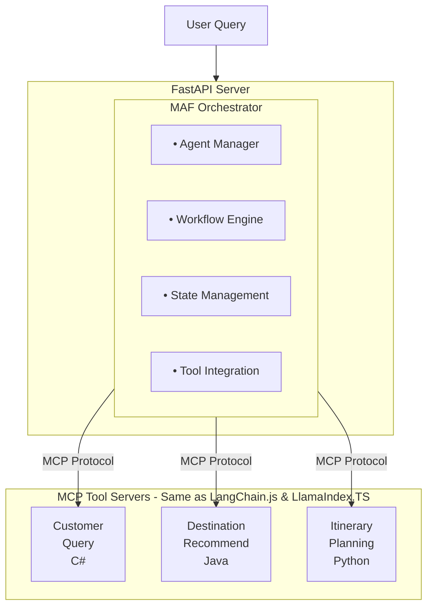
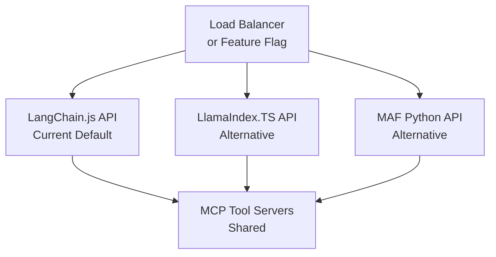

# Agent Orchestration Options

The Azure AI Travel Agents system provides three approaches for orchestrating AI agents, allowing you to choose the best fit for your team, technology stack, and requirements.

## Overview

All three orchestration options provide the same core functionality: coordinating multiple specialized AI agents to handle complex travel planning queries. They differ primarily in implementation language, framework, and ecosystem integration.

## Current Production: LangChain.js

### Architecture

The current production system uses **LangChain.js** for agent orchestration, built on:
- **Language**: TypeScript
- **Runtime**: Node.js 22+
- **Web Framework**: Express.js 5.0
- **Agent Framework**: LangChain.js + LangGraph
- **MCP Integration**: Official `@langchain/mcp-adapters`
- **Streaming**: `streamEvents` pattern for real-time responses

### System Flow



### Key Features

**Strengths**:
- ✅ **Current production default** - actively maintained
- ✅ Official MCP adapter support via `@langchain/mcp-adapters`
- ✅ Advanced streaming with `streamEvents` pattern
- ✅ LangGraph supervisor pattern for complex workflows
- ✅ Rich ecosystem of integrations and tools
- ✅ Multiple LLM provider support (Azure OpenAI, Docker Models, GitHub Models, Ollama, Foundry Local)
- ✅ Active community and extensive documentation
- ✅ TypeScript type safety
- ✅ Native Node.js ecosystem integration

**Implementation Details**:
- Location: `packages/langchain-js/src/`
- Entry Point: `packages/langchain-js/src/server.ts or packages/llamaindex-ts/src/server.ts`
- Providers: `packages/langchain-js/src/providers/`
- Documentation: [Technical Architecture](./technical-architecture.md#agent-orchestration)

**Best For**:
- Building complex LLM workflows with branching logic
- Teams with TypeScript/Node.js expertise
- Projects requiring extensive tool and integration support
- Organizations needing proven, battle-tested orchestration
- Existing Node.js infrastructure

## Alternative 1: LlamaIndex.TS

### Architecture

LlamaIndex.TS is available as an alternative TypeScript implementation in `packages/llamaindex-ts/src/`:
- **Language**: TypeScript
- **Runtime**: Node.js 22+
- **Web Framework**: Express.js 5.0
- **Agent Framework**: LlamaIndex.TS
- **MCP Integration**: Native MCP client implementation

### System Flow



### Key Features

**Strengths**:
- ✅ Available alternative implementation
- ✅ TypeScript type safety
- ✅ Simple and intuitive agent API
- ✅ Excellent for RAG (Retrieval-Augmented Generation) use cases
- ✅ Strong data indexing and retrieval capabilities
- ✅ Native Node.js ecosystem integration
- ✅ Express.js middleware ecosystem
- ✅ Well-documented
- ✅ Seamless SSE streaming

**Implementation Details**:
- Location: `packages/llamaindex-ts/src/`
- Switch: Change import in `packages/langchain-js/src/server.ts or packages/llamaindex-ts/src/server.ts`
- Documentation: [Technical Architecture](./technical-architecture.md#agent-orchestration)

**Best For**:
- Projects heavily focused on document indexing and retrieval
- Teams preferring LlamaIndex's simplified agent model
- RAG-centric applications
- Existing LlamaIndex infrastructure
- Teams with TypeScript expertise

## Alternative 2: Microsoft Agent Framework

### Architecture

The Microsoft Agent Framework (MAF) implementation is **fully implemented** in `packages/langchain-js and packages/llamaindex-ts-python/`:
- **Language**: Python 3.11+
- **Runtime**: Python with asyncio
- **Web Framework**: FastAPI
- **Agent Framework**: Microsoft Agent Framework SDK (`agent-framework`)
- **MCP Integration**: Built-in `MCPStreamableHTTPTool`
- **Orchestration**: Magentic pattern for multi-agent workflows

### System Flow



### Key Features

**Strengths**:
- ✅ Native Azure AI Foundry integration
- ✅ Python AI/ML ecosystem access
- ✅ Microsoft backing and support
- ✅ Modern agent architecture patterns
- ✅ Pydantic data validation
- ✅ FastAPI performance and async support
- ✅ Advanced state management
- ✅ Built-in workflow patterns

**Implementation Details**:
- Status: ✅ Fully implemented and functional
- Location: `packages/langchain-js and packages/llamaindex-ts-python/`
- Documentation: See `packages/langchain-js and packages/llamaindex-ts-python/README.md`
- Architecture: `packages/langchain-js and packages/llamaindex-ts-python/ARCHITECTURE_DIAGRAMS.md`
- Developer Guide: `packages/langchain-js and packages/llamaindex-ts-python/DEVELOPER_GUIDE.md`

**Best For**:
- Teams with Python expertise
- Advanced AI/ML requirements
- Azure-native architecture preferences
- Projects leveraging Python data science tools
- Integration with Python-based ML pipelines

## Side-by-Side Comparison

| Feature | LangChain.js | LlamaIndex.TS | Microsoft Agent Framework |
|---------|--------------|---------------|---------------------------|
| **Language** | TypeScript | TypeScript | Python |
| **Runtime** | Node.js 22+ | Node.js 22+ | Python 3.11+ |
| **Web Framework** | Express.js | Express.js | FastAPI |
| **Status** | **Production (Current)** | Available Alternative | Fully Implemented |
| **Azure Integration** | Via Azure SDK | Via Azure SDK | Native via agent-framework |
| **Type Safety** | TypeScript | TypeScript | Pydantic |
| **Async Support** | Promises/async-await | Promises/async-await | asyncio/async-await |
| **Performance** | Excellent | Excellent | Excellent |
| **Ecosystem** | npm/Node.js | npm/Node.js | PyPI/Python |
| **AI/ML Libraries** | Limited | Limited | Extensive (pandas, numpy, etc.) |
| **Learning Curve** | Low-Medium | Low-Medium | Medium |
| **Community** | Large & Active | Large | Growing |
| **MCP Integration** | Official `@langchain/mcp-adapters` | Native client | Built-in MCPStreamableHTTPTool |
| **Streaming Pattern** | `streamEvents` | Native SSE | FastAPI SSE |
| **State Management** | LangGraph | Custom | Framework-provided |
| **Workflow Pattern** | Supervisor | Triage Agent | Magentic |
| **Observability** | OpenTelemetry | OpenTelemetry | OpenTelemetry |
| **Deployment** | Container Apps | Container Apps | Container Apps |
| **Best For** | Complex workflows, proven stability | RAG applications, simple agents | Python ML teams, Azure-native |
| **Implementation Location** | `packages/langchain-js/src/` | `packages/llamaindex-ts/src/` | `packages/langchain-js and packages/llamaindex-ts-python/` |

## Common Elements

All three orchestration approaches share:

### Same MCP Tool Infrastructure
- Customer Query Server (C#/.NET)
- Destination Recommendation (Java)
- Itinerary Planning (Python)
- Echo Ping (TypeScript)

### Same Core Capabilities
- Multi-agent coordination
- Tool invocation via MCP
- Real-time streaming responses
- State management
- Error handling and retry logic
- Observability with OpenTelemetry

### Same Frontend
- Angular 19 UI
- TypeScript implementation
- Server-Sent Events for streaming
- No changes required for either orchestration option

### Same Deployment
- Docker containers
- Azure Container Apps
- Azure OpenAI integration
- Aspire Dashboard for monitoring

## Switching Between Orchestrations

### TypeScript Orchestrations (LangChain.js ↔ LlamaIndex.TS)

Both TypeScript implementations are in the same codebase and can be switched by changing the import in `packages/langchain-js/src/server.ts or packages/llamaindex-ts/src/server.ts`:

```typescript
// For LangChain.js (current default)
import { setupAgents } from "@azure-ai-travel-agents/langchain-jsindex.js";

// For LlamaIndex.TS
import { setupAgents } from "./orchestrator/llamaindex/index.js";
```

Both use the same Express.js server and MCP infrastructure, so the switch is minimal.

### Running Multiple Orchestrations

You can run different orchestrations simultaneously:

```bash
# Terminal 1: Run LangChain.js or LlamaIndex.TS API
cd packages/langchain-js and packages/llamaindex-ts
npm start  # Runs on port 4000

# Terminal 2: Run Microsoft Agent Framework API
cd packages/langchain-js and packages/llamaindex-ts-python
uvicorn main:app --reload --port 8000  # Runs on port 8000
```

This allows for:
- Side-by-side comparison
- Gradual migration
- Serving different use cases
- A/B testing

## Migration Strategy

### Parallel Deployment Approach

The recommended strategy is **parallel deployment**, allowing all systems to run simultaneously:



### Migration Phases

1. **Phase 1: Evaluate** (Current State)
   - All three implementations available
   - LangChain.js is production default
   - LlamaIndex.TS available in same codebase
   - MAF implementation in `packages/langchain-js and packages/llamaindex-ts-python/`
   - Review and test locally
   - Compare functionality across all three
   - Assess team expertise and requirements

2. **Phase 2: Deploy Parallel** (Optional)
   - Deploy multiple APIs simultaneously
   - Route traffic based on feature flags
   - Monitor performance and errors
   - Validate feature parity

3. **Phase 3: Choose Path**
   - **Option A**: Keep LangChain.js (current default, proven)
   - **Option B**: Switch to LlamaIndex.TS (RAG-focused, TypeScript)
   - **Option C**: Migrate to MAF (Python-native, Azure-native)
   - **Option D**: Run multiple long-term (serve different use cases)

4. **Phase 4: Complete Transition** (If migrating)
   - Increase traffic to chosen solution
   - Deprecate unused API if needed
   - Documentation updates
   - Team training

### Risk Mitigation

- **Feature Flags**: Control traffic routing dynamically
- **A/B Testing**: Compare performance metrics across orchestrators
- **Rollback Plan**: Quick revert to LangChain.js if needed
- **Monitoring**: Comprehensive metrics and alerts
- **Testing**: Extensive integration and E2E tests

## Decision Framework

### Choose LangChain.js if:

- ✅ You want the **current production default**
- ✅ Your team has strong TypeScript expertise
- ✅ You need proven, battle-tested orchestration
- ✅ You want official MCP adapter support
- ✅ You need complex workflow patterns (LangGraph)
- ✅ You prefer extensive ecosystem integrations
- ✅ You want active community support
- ✅ You have existing Node.js infrastructure
- ✅ Time-to-market is critical

### Choose LlamaIndex.TS if:

- ✅ Your team has strong TypeScript expertise
- ✅ You have existing Node.js infrastructure
- ✅ You need RAG-focused capabilities
- ✅ You prefer simpler agent APIs
- ✅ You want strong data indexing/retrieval
- ✅ You have limited Python experience
- ✅ You prefer LlamaIndex's design philosophy
- ✅ You want to leverage Express.js middleware

### Choose Microsoft Agent Framework if:

- ✅ Your team has strong Python expertise
- ✅ You want to leverage Python's AI/ML ecosystem
- ✅ You prefer Microsoft's native agent framework
- ✅ You want built-in MCP tool support
- ✅ FastAPI performance appeals to your use case
- ✅ You're comfortable with async Python patterns
- ✅ You want to evaluate the Python alternative
- ✅ You need native integration with Python ML libraries

### Choose Parallel Deployment if:

- ✅ You want to evaluate multiple options
- ✅ You need risk-free migration path
- ✅ You have resources for multiple approaches
- ✅ You want to compare performance empirically
- ✅ You need gradual transition
- ✅ You want to preserve optionality
- ✅ Different teams prefer different technologies

## Getting Started

### Using LangChain.js (Current Default)

Already active as the production default. See:
- [Technical Architecture](./technical-architecture.md#agent-orchestration)
- [Development Guide](./development-guide.md)
- Source: `packages/langchain-js/src/`

**Key Files**:
- `packages/langchain-js/src/index.ts` - Setup and initialization
- `packages/langchain-js/src/graph/index.ts` - LangGraph workflow
- `packages/langchain-js/src/agents/index.ts` - Agent definitions
- `packages/langchain-js/src/providers/` - LLM providers

### Using LlamaIndex.TS (Available Alternative)

Switch by changing the import in `packages/langchain-js/src/server.ts or packages/llamaindex-ts/src/server.ts`:
```typescript
import { setupAgents } from "./orchestrator/llamaindex/index.js";
```

See:
- [Technical Architecture](./technical-architecture.md#agent-orchestration)
- Source: `packages/llamaindex-ts/src/`

**Key Files**:
- `packages/llamaindex-ts/src/index.ts` - Setup function
- `packages/llamaindex-ts/src/tools/` - Tool implementations
- `packages/llamaindex-ts/src/agents/` - Agent definitions

### Using Microsoft Agent Framework (Python Alternative)

The MAF implementation is **already complete** and available for use:

**Quick Start**:
```bash
cd packages/langchain-js and packages/llamaindex-ts-python

# Install dependencies
pip install -e .

# Configure (copy .env.sample to .env and set values)
cp .env.sample .env

# Run the server
uvicorn main:app --reload
```

**Documentation**:
- **README**: `packages/langchain-js and packages/llamaindex-ts-python/README.md` - Getting started and overview
- **Architecture**: `packages/langchain-js and packages/llamaindex-ts-python/ARCHITECTURE_DIAGRAMS.md` - System design and flow diagrams
- **Developer Guide**: `packages/langchain-js and packages/llamaindex-ts-python/DEVELOPER_GUIDE.md` - Development setup and workflows
- **MCP Integration**: `packages/langchain-js and packages/llamaindex-ts-python/MCP_QUICK_REFERENCE.md` - MCP tool usage patterns
- **Implementation**: `packages/langchain-js and packages/llamaindex-ts-python/IMPLEMENTATION_GUIDE.md` - Technical implementation details
- **Event Streaming**: `packages/langchain-js and packages/llamaindex-ts-python/EVENT_STREAMING.md` - SSE streaming architecture

**Key Implementation Files**:
- `packages/langchain-js and packages/llamaindex-ts-python/src/main.py` - FastAPI application entry point
- `packages/langchain-js and packages/llamaindex-ts-python/src/orchestrator/magentic_workflow.py` - Magentic orchestration
- `packages/langchain-js and packages/llamaindex-ts-python/src/orchestrator/workflow.py` - Alternative workflow implementation
- `packages/langchain-js and packages/llamaindex-ts-python/src/orchestrator/agents/` - All agent implementations
- `packages/langchain-js and packages/llamaindex-ts-python/src/orchestrator/tools/` - MCP tool registry and wrappers

### Parallel Deployment

Follow the migration plan in [MAF Migration Plan](./maf-migration-plan.md) for detailed instructions on deploying multiple systems simultaneously.

## Performance Considerations

### LangChain.js Performance

- Response time: < 2s (95th percentile)
- Throughput: High concurrent requests
- Memory: Efficient Node.js event loop with streaming
- Scaling: Horizontal scaling via Container Apps
- Streaming: Excellent with `streamEvents` pattern

### LlamaIndex.TS Performance

- Response time: < 2s (95th percentile)
- Throughput: High concurrent requests
- Memory: Efficient Node.js event loop
- Scaling: Horizontal scaling via Container Apps

### MAF Expected Performance

- Response time: Target < 2s (95th percentile)
- Throughput: High via FastAPI async
- Memory: Python async with proper resource management
- Scaling: Horizontal scaling via Container Apps

Both approaches support:
- Auto-scaling based on load
- Connection pooling
- Caching strategies
- Rate limiting
- Request queuing

## Monitoring and Observability

Both orchestration options integrate with:

- **OpenTelemetry**: Distributed tracing
- **Aspire Dashboard**: Real-time monitoring
- **Azure Monitor**: Cloud-native observability
- **Custom Metrics**: Business and technical KPIs

Monitoring includes:
- Request latency and throughput
- Error rates and types
- Agent execution time
- MCP tool performance
- Resource utilization

## Support and Resources

### LlamaIndex.TS Resources
- [LlamaIndex Documentation](https://ts.llamaindex.ai/)
- [Technical Architecture](./technical-architecture.md)
- [Development Guide](./development-guide.md)

### Microsoft Agent Framework Resources
- [MAF GitHub Repository](https://github.com/microsoft/agent-framework)
- [MAF Documentation](https://learn.microsoft.com/en-us/agent-framework/)
- [MAF Documentation Hub](./MAF-README.md)
- [MAF Implementation Guide](./maf-implementation-guide.md)

### Community Support
- [Azure AI Discord](https://aka.ms/foundry/discord)
- [Azure AI Forum](https://aka.ms/foundry/forum)
- GitHub Issues and Discussions

## Conclusion

Both LlamaIndex.TS and Microsoft Agent Framework provide robust orchestration capabilities for the Azure AI Travel Agents system. The choice depends on your team's expertise, technology preferences, and specific requirements.

**Current State**: 
- **LlamaIndex.TS** (in `packages/langchain-js and packages/llamaindex-ts/`) is the production-ready, battle-tested implementation
- **Microsoft Agent Framework** (in `packages/langchain-js and packages/llamaindex-ts-python/`) is a fully implemented alternative ready for evaluation

**Recommendation**: Evaluate the MAF implementation in `packages/langchain-js and packages/llamaindex-ts-python/` to determine if it better fits your team's needs. Both implementations are production-ready and can run in parallel if desired.

The parallel deployment option ensures you can evaluate both approaches in your environment, making an informed decision based on real-world performance and team experience.

---

**Last Updated**: 2025-01-02

For questions or guidance on choosing an orchestration approach, please open a GitHub issue or contact the project team.
