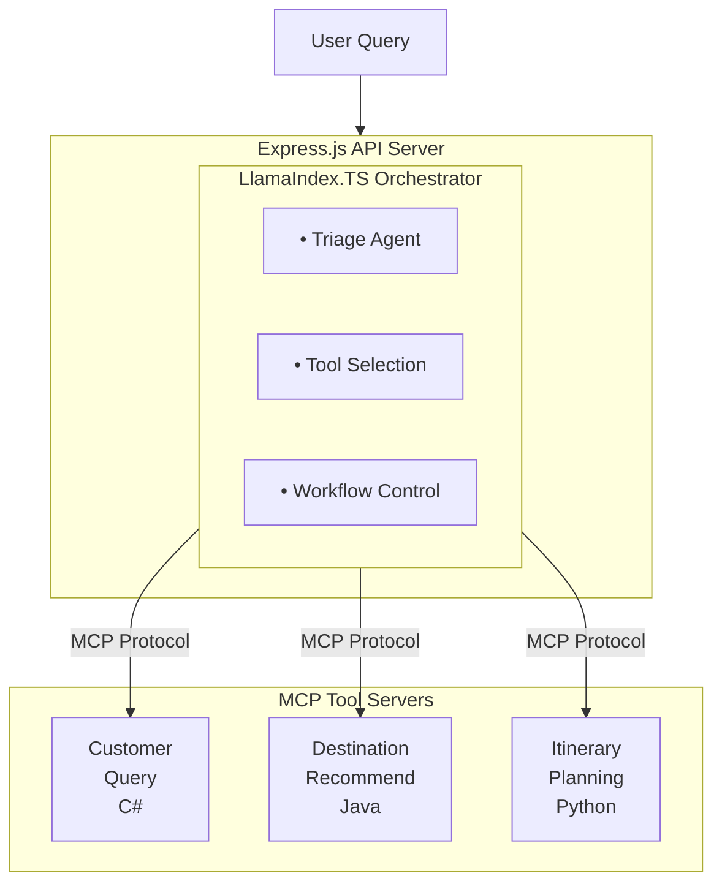
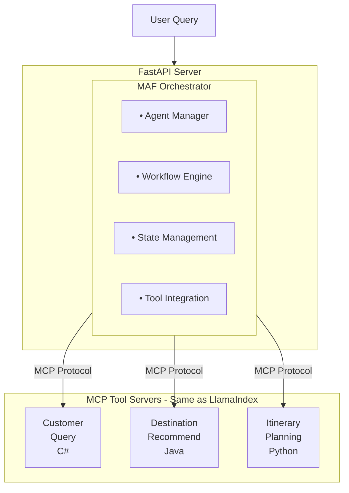
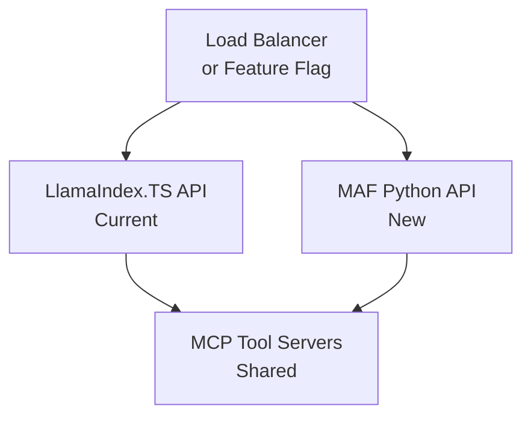

# Agent Orchestration Options

The Azure AI Travel Agents system provides two approaches for orchestrating AI agents, allowing you to choose the best fit for your team, technology stack, and requirements.

## Overview

Both orchestration options provide the same core functionality: coordinating multiple specialized AI agents to handle complex travel planning queries. They differ primarily in implementation language, framework, and ecosystem integration.

## Current Production: LlamaIndex.TS

### Architecture

The current production system uses **LlamaIndex.TS** for agent orchestration, built on:
- **Language**: TypeScript
- **Runtime**: Node.js 22+
- **Web Framework**: Express.js 5.0
- **Agent Framework**: LlamaIndex.TS
- **MCP Integration**: Native MCP client implementation

### System Flow



### Key Features

**Strengths**:
- ✅ Production-proven stability
- ✅ TypeScript type safety
- ✅ Native Node.js ecosystem integration
- ✅ Express.js middleware ecosystem
- ✅ Well-documented and battle-tested
- ✅ Active community support
- ✅ Seamless SSE streaming

**Implementation Details**:
- Location: `packages/api/src/orchestrator/llamaindex/`
- Entry Point: `packages/api/src/index.ts`
- Documentation: [Technical Architecture](./technical-architecture.md#agent-orchestration)

**Best For**:
- Teams with TypeScript expertise
- Existing Node.js infrastructure
- Projects requiring minimal migration risk
- Organizations prioritizing proven stability

## Alternative: Microsoft Agent Framework

### Architecture

The Microsoft Agent Framework (MAF) implementation is **fully implemented** in `packages/api-python/`:
- **Language**: Python 3.11+
- **Runtime**: Python with asyncio
- **Web Framework**: FastAPI
- **Agent Framework**: Microsoft Agent Framework SDK (`agent-framework`)
- **MCP Integration**: Built-in `MCPStreamableHTTPTool`
- **Orchestration**: Magentic pattern for multi-agent workflows

### System Flow



### Key Features

**Strengths**:
- ✅ Native Azure AI Foundry integration
- ✅ Python AI/ML ecosystem access
- ✅ Microsoft backing and support
- ✅ Modern agent architecture patterns
- ✅ Pydantic data validation
- ✅ FastAPI performance and async support
- ✅ Advanced state management
- ✅ Built-in workflow patterns

**Implementation Details**:
- Status: ✅ Fully implemented and functional
- Location: `packages/api-python/`
- Documentation: See `packages/api-python/README.md`
- Architecture: `packages/api-python/ARCHITECTURE_DIAGRAMS.md`
- Developer Guide: `packages/api-python/DEVELOPER_GUIDE.md`

**Best For**:
- Teams with Python expertise
- Advanced AI/ML requirements
- Azure-native architecture preferences
- Projects leveraging Python data science tools

## Side-by-Side Comparison

| Feature | LlamaIndex.TS | Microsoft Agent Framework |
|---------|---------------|---------------------------|
| **Language** | TypeScript | Python |
| **Runtime** | Node.js 22+ | Python 3.11+ |
| **Web Framework** | Express.js | FastAPI |
| **Maturity** | Production-ready | Fully implemented |
| **Azure Integration** | Via Azure SDK | Native via agent-framework |
| **Type Safety** | TypeScript | Pydantic |
| **Async Support** | Promises/async-await | asyncio/async-await |
| **Performance** | Excellent | Excellent |
| **Ecosystem** | npm/Node.js | PyPI/Python |
| **AI/ML Libraries** | Limited | Extensive (pandas, numpy, etc.) |
| **Learning Curve** | Low-Medium | Medium |
| **Community** | Large | Growing |
| **MCP Integration** | Native client | Built-in MCPStreamableHTTPTool |
| **State Management** | Custom | Framework-provided |
| **Streaming** | SSE via Express | SSE via FastAPI |
| **Observability** | OpenTelemetry | OpenTelemetry |
| **Deployment** | Container Apps | Container Apps |
| **Implementation Location** | `packages/api/` | `packages/api-python/` |

## Common Elements

Both orchestration approaches share:

### Same MCP Tool Infrastructure
- Customer Query Server (C#/.NET)
- Destination Recommendation (Java)
- Itinerary Planning (Python)
- Travel Restrictions (TypeScript)
- Web Search (TypeScript)
- Code Interpreter (Python)
- Echo Ping (TypeScript)

### Same Core Capabilities
- Multi-agent coordination
- Tool invocation via MCP
- Real-time streaming responses
- State management
- Error handling and retry logic
- Observability with OpenTelemetry

### Same Frontend
- Angular 19 UI
- TypeScript implementation
- Server-Sent Events for streaming
- No changes required for either orchestration option

### Same Deployment
- Docker containers
- Azure Container Apps
- Azure OpenAI integration
- Aspire Dashboard for monitoring

## Migration Strategy

### Parallel Deployment Approach

The recommended strategy is **parallel deployment**, allowing both systems to run simultaneously:



### Migration Phases

1. **Phase 1: Evaluate** (Current State)
   - MAF implementation already available in `packages/api-python/`
   - Review implementation and test locally
   - Compare functionality with LlamaIndex.TS
   - Assess team Python expertise

2. **Phase 2: Deploy Parallel** (Optional)
   - Deploy both APIs simultaneously
   - Route small percentage to MAF
   - Monitor performance and errors
   - Validate feature parity

3. **Phase 3: Choose Path**
   - **Option A**: Keep LlamaIndex.TS (if it meets all needs)
   - **Option B**: Gradually migrate to MAF (if Python preferred)
   - **Option C**: Run both long-term (serve different use cases)

4. **Phase 4: Complete Transition** (If migrating)
   - Increase traffic to chosen solution
   - Deprecate unused API
   - Documentation updates
   - Team training

### Risk Mitigation

- **Feature Flags**: Control traffic routing dynamically
- **A/B Testing**: Compare performance metrics
- **Rollback Plan**: Quick revert to LlamaIndex if needed
- **Monitoring**: Comprehensive metrics and alerts
- **Testing**: Extensive integration and E2E tests

## Decision Framework

### Choose LlamaIndex.TS if:

- ✅ Your team has strong TypeScript expertise
- ✅ You have existing Node.js infrastructure
- ✅ You need minimal migration risk
- ✅ You prefer proven, stable solutions
- ✅ You want to leverage Express.js middleware
- ✅ You have limited Python experience
- ✅ Time-to-market is critical

### Choose Microsoft Agent Framework if:

- ✅ Your team has strong Python expertise
- ✅ You want to leverage Python's AI/ML ecosystem
- ✅ You prefer Microsoft's native agent framework
- ✅ You want built-in MCP tool support
- ✅ FastAPI performance appeals to your use case
- ✅ You're comfortable with async Python patterns
- ✅ You want to evaluate the implemented alternative

### Choose Parallel Deployment if:

- ✅ You want to evaluate both options
- ✅ You need risk-free migration path
- ✅ You have resources for both approaches
- ✅ You want to compare performance empirically
- ✅ You need gradual transition
- ✅ You want to preserve optionality

## Getting Started

### Using LlamaIndex.TS (Current)

Already active in the repository. See:
- [Technical Architecture](./technical-architecture.md#agent-orchestration)
- [Development Guide](./development-guide.md)
- Source: `packages/api/`

### Implementing Microsoft Agent Framework

The MAF implementation is **already complete** and available for use:

**Quick Start**:
```bash
cd packages/api-python

# Install dependencies
pip install -e .

# Configure (copy .env.sample to .env and set values)
cp .env.sample .env

# Run the server
uvicorn main:app --reload
```

**Documentation**:
- **README**: `packages/api-python/README.md` - Getting started and overview
- **Architecture**: `packages/api-python/ARCHITECTURE_DIAGRAMS.md` - System design and flow diagrams
- **Developer Guide**: `packages/api-python/DEVELOPER_GUIDE.md` - Development setup and workflows
- **MCP Integration**: `packages/api-python/MCP_QUICK_REFERENCE.md` - MCP tool usage patterns
- **Implementation**: `packages/api-python/IMPLEMENTATION_GUIDE.md` - Technical implementation details
- **Event Streaming**: `packages/api-python/EVENT_STREAMING.md` - SSE streaming architecture

**Key Implementation Files**:
- `packages/api-python/src/main.py` - FastAPI application entry point
- `packages/api-python/src/orchestrator/magentic_workflow.py` - Magentic orchestration
- `packages/api-python/src/orchestrator/workflow.py` - Alternative workflow implementation
- `packages/api-python/src/orchestrator/agents/` - All agent implementations
- `packages/api-python/src/orchestrator/tools/` - MCP tool registry and wrappers

### Parallel Deployment

Follow the migration plan in [MAF Migration Plan](./maf-migration-plan.md) for detailed instructions on deploying both systems simultaneously.

## Performance Considerations

### LlamaIndex.TS Performance

- Response time: < 2s (95th percentile)
- Throughput: High concurrent requests
- Memory: Efficient Node.js event loop
- Scaling: Horizontal scaling via Container Apps

### MAF Expected Performance

- Response time: Target < 2s (95th percentile)
- Throughput: High via FastAPI async
- Memory: Python async with proper resource management
- Scaling: Horizontal scaling via Container Apps

Both approaches support:
- Auto-scaling based on load
- Connection pooling
- Caching strategies
- Rate limiting
- Request queuing

## Monitoring and Observability

Both orchestration options integrate with:

- **OpenTelemetry**: Distributed tracing
- **Aspire Dashboard**: Real-time monitoring
- **Azure Monitor**: Cloud-native observability
- **Custom Metrics**: Business and technical KPIs

Monitoring includes:
- Request latency and throughput
- Error rates and types
- Agent execution time
- MCP tool performance
- Resource utilization

## Support and Resources

### LlamaIndex.TS Resources
- [LlamaIndex Documentation](https://ts.llamaindex.ai/)
- [Technical Architecture](./technical-architecture.md)
- [Development Guide](./development-guide.md)

### Microsoft Agent Framework Resources
- [MAF GitHub Repository](https://github.com/microsoft/agent-framework)
- [MAF Documentation](https://learn.microsoft.com/en-us/agent-framework/)
- [MAF Documentation Hub](./MAF-README.md)
- [MAF Implementation Guide](./maf-implementation-guide.md)

### Community Support
- [Azure AI Discord](https://aka.ms/foundry/discord)
- [Azure AI Forum](https://aka.ms/foundry/forum)
- GitHub Issues and Discussions

## Conclusion

Both LlamaIndex.TS and Microsoft Agent Framework provide robust orchestration capabilities for the Azure AI Travel Agents system. The choice depends on your team's expertise, technology preferences, and specific requirements.

**Current State**: 
- **LlamaIndex.TS** (in `packages/api/`) is the production-ready, battle-tested implementation
- **Microsoft Agent Framework** (in `packages/api-python/`) is a fully implemented alternative ready for evaluation

**Recommendation**: Evaluate the MAF implementation in `packages/api-python/` to determine if it better fits your team's needs. Both implementations are production-ready and can run in parallel if desired.

The parallel deployment option ensures you can evaluate both approaches in your environment, making an informed decision based on real-world performance and team experience.

---

**Last Updated**: 2025-01-02

For questions or guidance on choosing an orchestration approach, please open a GitHub issue or contact the project team.
