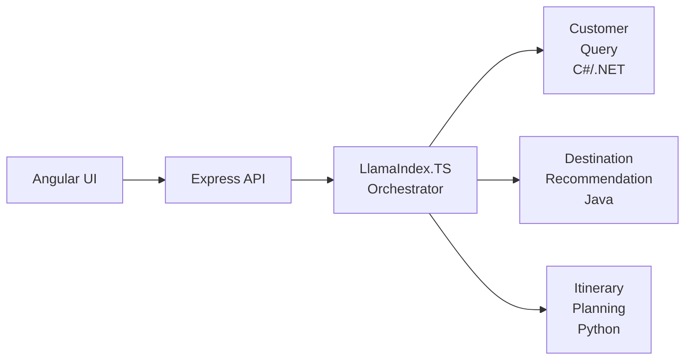
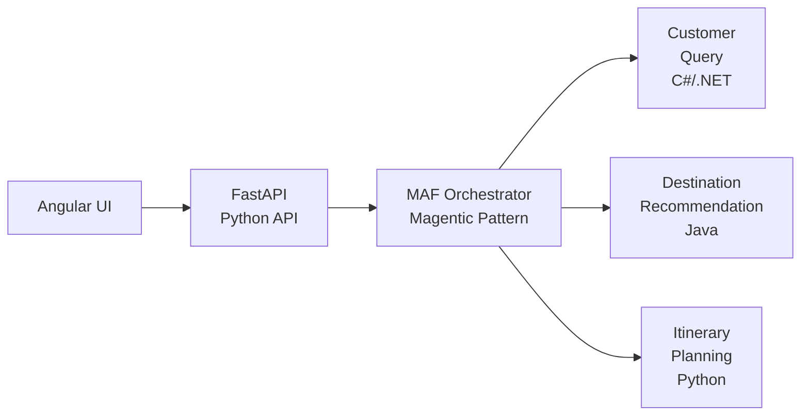

# Overview

This directory contains comprehensive technical documentation for architects, developers, and system administrators working with the Azure AI Travel Agents system.

## Documentation Overview

### Architecture & Design
- **[Technical Architecture](./technical-architecture.md)** - Complete system architecture, components, and design patterns
- **[Data Flow & Sequence Diagrams](./flow-diagrams.md)** - Visual representations of request flows and component interactions

### Implementation Guides
- **[MCP Server Implementation](./mcp-servers.md)** - Detailed guide for Model Context Protocol servers across multiple languages
- **[Development Guide](./development-guide.md)** - Comprehensive developer onboarding and contribution guide

### Operations & Deployment
- **[Deployment Architecture](./deployment-architecture.md)** - Infrastructure, deployment strategies, and production configurations

### Orchestration Options

The system supports three orchestration approaches for coordinating AI agents:

#### Current Implementation: LangChain.js
The production system currently uses **LangChain.js** for agent orchestration, providing:
- TypeScript-based workflow management with LangGraph supervisor pattern
- Official `@langchain/mcp-adapters` for MCP integration
- Node.js/Express.js integration
- Advanced streaming with `streamEvents` pattern
- Multiple LLM provider support (Azure OpenAI, Docker Models, GitHub Models, Ollama, Foundry Local)
- Comprehensive tool integration via MCP

See [Orchestration Options](./orchestration.md) for detailed comparison.

#### Alternative: LlamaIndex.TS
Available as an alternative TypeScript implementation in `packages/api/src/orchestrator/llamaindex/`:
- TypeScript-based workflow management
- Node.js/Express.js integration
- Established stability and performance
- Comprehensive tool integration via MCP
- Excellent for RAG (Retrieval-Augmented Generation) use cases

See [Technical Architecture - Agent Orchestration](./technical-architecture.md#agent-orchestration) for implementation details.

#### Alternative: Microsoft Agent Framework (MAF) Implementation

**IMPLEMENTED**: Working Python implementation using Microsoft Agent Framework for agent orchestration.

Located in `packages/api-python/`, this is a complete, production-ready alternative to the TypeScript API that uses:
- **Microsoft Agent Framework** (`agent-framework` Python SDK)
- **Magentic Orchestration** pattern for multi-agent workflows
- **Built-in MCP Support** via `MCPStreamableHTTPTool`
- **FastAPI** for high-performance async API
- **Real-time SSE Streaming** with asyncio.Queue

**Implementation Status**: ✅ Fully implemented and functional

**Key Features**:
- ✅ Native Azure OpenAI integration (plus GitHub Models, Ollama, Docker Models)
- ✅ 7 specialized agents (Customer Query, Itinerary Planning, Destination, Code Eval, Model Inference, Web Search, Echo)
- ✅ Graceful degradation when MCP servers are unavailable
- ✅ OpenTelemetry observability ready
- ✅ Proper async lifecycle management

**Documentation**:
- Implementation details: `packages/api-python/README.md`
- Architecture diagrams: `packages/api-python/ARCHITECTURE_DIAGRAMS.md`
- Developer guide: `packages/api-python/DEVELOPER_GUIDE.md`
- MCP integration: `packages/api-python/MCP_QUICK_REFERENCE.md`

**Status**: Alternative implementation available for evaluation and use alongside LangChain.js and LlamaIndex.TS.

> **Note**: All three orchestration approaches maintain compatibility with the existing MCP server architecture, ensuring no changes are needed to the specialized AI tool servers (Customer Query, Destination Recommendation, Itinerary Planning, etc.).

## System Architecture Overview

The Azure AI Travel Agents system is built on a microservices architecture with flexible orchestration options:

- **Frontend**: Angular UI with real-time streaming
- **API Server & Orchestration**: 
  - **Current**: Express.js with LangChain.js orchestration (TypeScript)
  - **Alternative 1**: Express.js with LlamaIndex.TS orchestration (TypeScript)
  - **Alternative 2**: FastAPI with Microsoft Agent Framework (Python)
- **MCP Servers**: 7 specialized services in TypeScript, C#, Java, and Python
- **AI Services**: Azure OpenAI and custom model inference
- **Monitoring**: OpenTelemetry with Aspire Dashboard
- **Deployment**: Docker containers on Azure Container Apps

### Current Architecture (LangChain.js)

### Alternative Architecture (Microsoft Agent Framework)

**IMPLEMENTED** in `packages/api-python/`

> **Note**: Both orchestration approaches use the same MCP server infrastructure, ensuring consistent tool functionality regardless of the orchestration choice.

## Quick Start for Different Roles

### For Architects
1. Start with [Technical Architecture](./technical-architecture.md) for system overview
2. Review orchestration options: [LlamaIndex.TS](./technical-architecture.md#agent-orchestration) vs [MAF](./maf-comparison.md)
3. Examine [MAF Orchestration Design](./maf-orchestration-design.md) for alternative architecture
4. Review [Deployment Architecture](./deployment-architecture.md) for infrastructure planning
5. Examine [Flow Diagrams](./flow-diagrams.md) for interaction patterns

### For Developers
1. Follow [Development Guide](./development-guide.md) for environment setup
2. Study [MCP Server Implementation](./mcp-servers.md) for service development
3. Reference [Technical Architecture](./technical-architecture.md) for current system integration
4. Explore [MAF Implementation Guide](./maf-implementation-guide.md) for Python-based orchestration
5. Use [MAF Quick Reference](./maf-quick-reference.md) for code patterns and examples

### For DevOps/Operations
1. Review [Deployment Architecture](./deployment-architecture.md) for deployment strategies
2. Check monitoring sections in [Technical Architecture](./technical-architecture.md)
3. Follow production deployment guides

## Key Technologies

| Component | Technology | Purpose |
|-----------|------------|---------|
| **Frontend** | Angular 19, TypeScript, Tailwind CSS | User interface and real-time chat |
| **API Server (Current)** | Node.js, Express.js, LlamaIndex.TS | Agent orchestration and API gateway |
| **API Server (Alternative)** | Python, FastAPI, Microsoft Agent Framework | Python-based agent orchestration (implemented) |
| **MCP Servers** | Multi-language (TS, C#, Java, Python) | Specialized AI tool implementations |
| **AI Services** | Azure OpenAI, ONNX, vLLM | Language models and inference |
| **Monitoring** | OpenTelemetry, Aspire Dashboard | Observability and tracing |
| **Deployment** | Docker, Azure Container Apps | Containerization and hosting |

## System Capabilities

- **Multi-Agent Orchestration**: Coordinated AI agents for complex travel planning
- **Flexible Orchestration**: Choice between LlamaIndex.TS (TypeScript) and Microsoft Agent Framework (Python)
- **Real-time Streaming**: Server-Sent Events for live response updates
- **Polyglot Architecture**: MCP servers in multiple programming languages
- **Scalable Deployment**: Azure Container Apps with auto-scaling
- **Comprehensive Monitoring**: Distributed tracing and metrics collection
- **Extensible Design**: Easy addition of new AI tools and capabilities

## Orchestration Options Comparison

The system provides two orchestration approaches, each with distinct advantages:

### LlamaIndex.TS (Current Production)
**Status**: ✅ Active, Production-Ready

**Advantages**:
- Proven stability and performance in production
- TypeScript integration with existing Node.js ecosystem
- Comprehensive documentation and community support
- Seamless Express.js integration
- Well-established MCP client patterns

**Best For**: Teams preferring TypeScript, existing Node.js infrastructure, minimal migration risk

### Microsoft Agent Framework (Implemented Alternative)
**Status**: ✅ Implemented, Available for Use

**Location**: `packages/api-python/`

**Advantages**:
- Native Microsoft Agent Framework SDK integration
- Python AI/ML ecosystem access
- FastAPI for high-performance async operations
- Built-in MCP support via `MCPStreamableHTTPTool`
- Multiple LLM provider support (Azure OpenAI, GitHub Models, Ollama, Docker Models)
- Magentic orchestration pattern for multi-agent workflows
- Graceful degradation when services unavailable

**Implemented Agents**:
- CustomerQueryAgent
- DestinationRecommendationAgent
- ItineraryPlanningAgent
- CodeEvaluationAgent
- ModelInferenceAgent
- WebSearchAgent
- EchoAgent (testing)

**Best For**: Python-first teams, teams wanting native MAF SDK, projects leveraging Python's AI ecosystem

**Deployment**: Can run parallel to TypeScript API for evaluation or as replacement.

See implementation documentation in `packages/api-python/README.md` for details.

## Documentation Features

Each documentation file includes:

- **Detailed Code Examples**: Copy-paste ready implementations
- **Architecture Diagrams**: Visual system representations
- **Configuration Templates**: Ready-to-use configurations
- **Troubleshooting Guides**: Common issues and solutions
- **Performance Guidelines**: Optimization best practices
- **Security Considerations**: Production-ready security patterns

## Document Structure

### Technical Architecture
- System overview and design principles
- Component specifications and interactions
- Data models and API contracts
- Development and extension guides

### Flow Diagrams
- Request/response flow patterns
- Agent interaction sequences
- Error handling and recovery flows
- Real-time communication patterns

### MCP Servers
- Protocol specifications and implementations
- Server-specific guides for each language
- Tool development and integration patterns
- Performance and scaling considerations

### API Documentation
- Complete endpoint reference
- Request/response schemas
- Authentication and security
- Client libraries and SDKs

### Deployment Architecture
- Infrastructure as Code templates
- Environment-specific configurations
- Monitoring and observability setup
- Production deployment strategies

### Development Guide
- Environment setup and tooling
- Coding standards and conventions
- Testing strategies and frameworks
- Contributing guidelines and workflows

### Orchestration Documentation
- LlamaIndex.TS implementation details
- Microsoft Agent Framework design and architecture
- Migration planning and strategies
- Comparison and decision frameworks
- Code examples and quick references

## Use Cases

This documentation supports:

- **System Architecture Planning**: Understanding component relationships and data flows
- **Development Onboarding**: Getting new developers productive quickly
- **Production Deployment**: Reliable, scalable infrastructure deployment
- **System Extension**: Adding new features and capabilities
- **Troubleshooting**: Diagnosing and resolving system issues
- **Performance Optimization**: Improving system performance and efficiency

## Getting Help

- **For Architecture Questions**: Review [Technical Architecture](./technical-architecture.md)
- **For Development Issues**: Check [Development Guide](./development-guide.md)
- **For Deployment Problems**: See [Deployment Architecture](./deployment-architecture.md)
- **For API Integration**: Reference [Technical Architecture](./technical-architecture.md)
- **For MCP Development**: Study [MCP Server Implementation](./mcp-servers.md)

## Documentation Updates

This documentation is maintained alongside the codebase. When contributing:

1. Update relevant documentation with code changes
2. Add examples for new features
3. Update diagrams for architectural changes
4. Maintain consistency across all documents

---

*This documentation reflects the current state of the Azure AI Travel Agents system and is updated regularly to maintain accuracy and completeness. If you notice any discrepancies or have suggestions for improvement, please submit an issue or pull request on [GitHub](https://github.com/Azure-Samples/azure-ai-travel-agents/issues/).*
